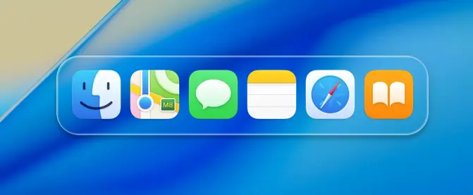

# https://bubenture.github.io/parodyOfGlass

 

    
    

 

Пародия стекла.
Элементы сгруппированы с помощью div с классами (wrapper, glass-wrapper, dock, glass-effect, glass-shine, glass-text).
Внутри блока dock размещены изображения (img) с иконками, для имитации панели Dock из macOS.
Мета-тег viewport обеспечивает корректное отображение на мобильных устройствах.
